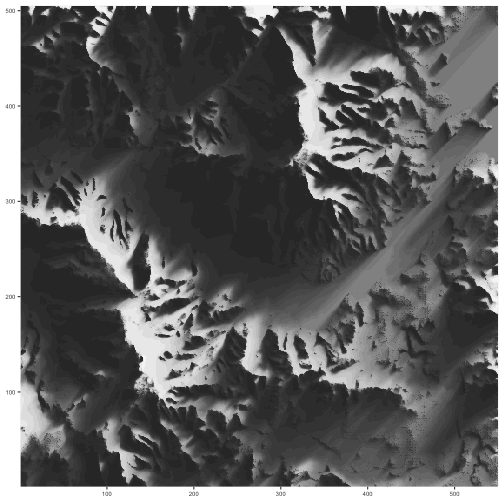

# Shadow

## Overview

This is a demo package that illustrates it is possible to write reasonably fast
ray-shading code in pure R.  It will not be published to CRAN.

This package implements:

* `shadow::ray_shade1`: the original for-loop based pure R shader.
* `shadow::ray_shade2`: a vectorized pure R shader


```r
elmat <- readRDS('extra/elmat.RDS') # http://tylermw.com/data/dem_01.tif.zip
system.time(shade <- shadow::ray_shade2(elmat, seq(-90, 90, length=25), 45))
```

```
##    user  system elapsed 
##  10.225   5.025  18.292
```

```r
shade.df <- cbind(do.call(expand.grid, lapply(dim(shade), seq_len)), z=c(shade))

library(ggplot2)
ggplot(shade.df, aes(x=Var1, y=Var2, fill=z)) +
  geom_raster() +
  scale_fill_gradient(low='#333333', high='#ffffff', guide=FALSE) +
  ylab(NULL) +  xlab(NULL) +
  scale_x_continuous(expand=c(0,0)) +
  scale_y_continuous(expand=c(0,0)) +
  theme(axis.text=element_text(size=6))
```



## Installation

This package is only available on github:

```
## devtools::install_github('brodieg/shadow'), or:
f.dl <- tempfile()
f.uz <- tempfile()
github.url <- 'https://github.com/brodieG/shadow/archive/master.zip'
download.file(github.url, f.dl)
unzip(f.dl, exdir=f.uz)
install.packages(file.path(f.uz, 'shadow-master'), repos=NULL, type='source')
unlink(c(f.dl, f.uz))
```

## Related Items

* Tyler Morgan Wall's [rayshader
  package](https://github.com/tylermorganwall/rayshader) and [blog
  post](http://www.tylermw.com/throwing-shade/)
* [Wolf Vollprecht's Next Journal
  article](https://nextjournal.com/wolfv/how-fast-is-r-with-fastr-pythran)
* My [blog post](https://www.brodieg.com/2018/10/23/do-not-shade-r/) on the
  topic.

